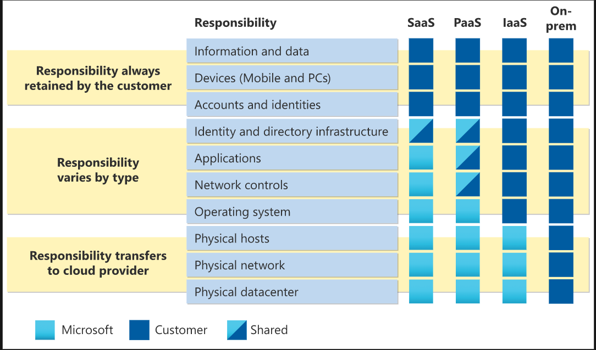

# Introduction to Microsoft Azure Fundamentals

| AZ-900 Domain Area                       | Weight |
| :--------------------------------------- | :----- |
| Describe cloud concepts                  | 25-30% |
| Describe Azure architecture and services | 35-40% |
| Describe Azure management and governance | 30-35% |

## Introduction to cloud computing

- Cloud computing is the delivery of computing services over the internet
- Computing services include common IT infrastructure such as virtual machines, storage, databases, and networking


## Shared Responsibility Model

- With the shared responsibility model, these responsibilities get shared between the cloud provider and the consumer
  - Physical security, power, cooling, and network connectivity are the responsibility of the cloud provider
  - The consumer is responsible for the data and information stored in the cloud
  - The consumer is also responsible for access security, meaning you only give access to those who need it



- You’ll always be responsible for:
  - The information and data stored in the cloud
  - Devices that are allowed to connect to your cloud (cell phones, computers, and so on)
  - The accounts and identities of the people, services, and devices within your organization

- The cloud provider is always responsible for:
  - The physical datacenter
  - The physical network
  - The physical hosts

- Your service model will determine responsibility for things like:
  - Operating systems
  - Network controls
  - Applications
  - Identity and infrastructure

## Cloud Models

| Public cloud                                                          | Private cloud                                                      | Hybrid cloud                                                      |
| :-------------------------------------------------------------------- | :----------------------------------------------------------------- | :---------------------------------------------------------------- |
| No capital expenditures to scale up                                   | Organizations have complete control over resources and security    | Provides the most flexibility                                     |
| Applications can be quickly provisioned and deprovisioned             | Data is not collocated with other organizations’ data              | Organizations determine where to run their applications           |
| Organizations pay only for what they use                              | Hardware must be purchased for startup and maintenance             | Organizations control security, compliance, or legal requirements |
| Organizations don’t have complete control over resources and security | Organizations are responsible for hardware maintenance and updates |                                                                   |

### Multi-cloud

- A fourth, and increasingly likely scenario is a multi-cloud scenario
- In a multi-cloud scenario, you use multiple public cloud providers
  - Maybe you use different features from different cloud providers
  - Or maybe you started your cloud journey with one provider and are in the process of migrating to a different provider

### Azure Arc

- Azure Arc is a set of technologies that helps manage your cloud environment.
- Azure Arc can help manage your cloud environment, whether it's a public cloud solely on Azure, a private cloud in your datacenter, a hybrid configuration, or even a multi-cloud environment running on multiple cloud providers at once.

### Azure VMware Solution

- What if you’re already established with VMware in a private cloud environment but want to migrate to a public or hybrid cloud? 
  - Azure VMware Solution lets you run your VMware workloads in Azure with seamless integration and scalability.

---

## Consumption-based model

- When comparing IT infrastructure models, there are two types of expenses to consider:
  - Capital expenditure (CapEx)
    - CapEx is typically a one-time, up-front expenditure to purchase or secure tangible resources.
    - A new building, repaving the parking lot, building a datacenter, or buying a company vehicle are examples of CapEx.
  - Operational expenditure (OpEx)
    - OpEx is spending money on services or products over time
    - Renting a convention center, leasing a company vehicle, or signing up for cloud services are all examples of OpEx

- This consumption-based model has many benefits, including:
  - No upfront costs.
  - No need to purchase and manage costly infrastructure that users might not use to its fullest potential.
  - The ability to pay for more resources when they're needed.
  - The ability to stop paying for resources that are no longer needed.

### Compare Cloud Pricing Models

- Cloud computing is the delivery of computing services over the internet by using a pay-as-you-go pricing model. You typically pay only for the cloud services you use, which helps you:
  - Plan and manage your operating costs.
  - Run your infrastructure more efficiently.
  - Scale as your business needs change.

---

## Describe the benefits of using cloud services

### Describe the benefits of high availability and scalability in the cloud

#### High availability

When you’re deploying an application, a service, or any IT resources, it’s important the resources are available when needed. High availability focuses on ensuring maximum availability, regardless of disruptions or events that may occur.

When you’re architecting your solution, you’ll need to account for service availability guarantees. Azure is a highly available cloud environment with uptime guarantees depending on the service. These guarantees are part of the service-level agreements (SLAs).

### Scalability

Another major benefit of cloud computing is the scalability of cloud resources. Scalability refers to the ability to adjust resources to meet demand. If you suddenly experience peak traffic and your systems are overwhelmed, the ability to scale means you can add more resources to better handle the increased demand.

The other benefit of scalability is that you aren't overpaying for services. Because the cloud is a consumption-based model, you only pay for what you use. If demand drops off, you can reduce your resources and thereby reduce your costs.

Scaling generally comes in two varieties: vertical and horizontal. Vertical scaling is focused on increasing or decreasing the capabilities of resources. Horizontal scaling is adding or subtracting the number of resources.

#### Vertical scaling

With vertical scaling, if you were developing an app and you needed more processing power, you could vertically scale up to add more CPUs or RAM to the virtual machine. Conversely, if you realized you had over-specified the needs, you could vertically scale down by lowering the CPU or RAM specifications.

#### Horizontal scaling

With horizontal scaling, if you suddenly experienced a steep jump in demand, your deployed resources could be scaled out (either automatically or manually). For example, you could add additional virtual machines or containers, scaling out. In the same manner, if there was a significant drop in demand, deployed resources could be scaled in (either automatically or manually), scaling in.

### Reliability

Reliability is the ability of a system to recover from failures and continue to function. It's also one of the pillars of the Microsoft Azure Well-Architected Framework.

The cloud, by virtue of its decentralized design, naturally supports a reliable and resilient infrastructure. With a decentralized design, the cloud enables you to have resources deployed in regions around the world. With this global scale, even if one region has a catastrophic event other regions are still up and running. You can design your applications to automatically take advantage of this increased reliability. In some cases, your cloud environment itself will automatically shift to a different region for you, with no action needed on your part. You’ll learn more about how Azure leverages global scale to provide reliability later in this series.

### Predictability

Predictability in the cloud lets you move forward with confidence. Predictability can be focused on performance predictability or cost predictability. Both performance and cost predictability are heavily influenced by the Microsoft Azure Well-Architected Framework. Deploy a solution built around this framework, and you have a solution with predictable cost and performance.

#### Performance

Performance predictability focuses on predicting the resources need to deliver a positive experience for your customers. Autoscaling, load balancing, and high availability are just some of the cloud concepts that support performance predictability. If you suddenly need more resources, autoscaling can deploy additional resources to meet the demand, and then scale back when the demand drops. Or if the traffic is heavily focused on one area, load balancing will help redirect some of the overload to less stressed areas.

#### Cost

Cost predictability is focused on predicting or forecasting the cost of the cloud spend. With the cloud, you can track your resource use in real time, monitor resources to ensure that you’re using them in the most efficient way, and apply data analytics to find patterns and trends that help better plan resource deployments. By operating in the cloud and using cloud analytics and information, you can predict future costs and adjust your resources as needed. You can even use tools like the Total Cost of Ownership (TCO) or Pricing Calculator to get an estimate of potential cloud spend.

### Describe the benefits of security and governance in the cloud

Whether you’re deploying infrastructure as a service or software as a service, cloud features support governance and compliance. Things like set templates help ensure that all your deployed resources meet corporate standards and government regulatory requirements. Plus, you can update all your deployed resources to new standards as standards change. Cloud-based auditing helps flag any resource that’s out of compliance with your corporate standards and provides mitigation strategies. Depending on your operating model, software patches and updates may also automatically be applied, which helps with both governance and security.

On the security side, you can find a cloud solution that matches your security needs. If you want maximum control of security, infrastructure as a service provides you with physical resources but lets you manage the operating systems and installed software, including patches and maintenance. If you want patches and maintenance taken care of automatically, platform as a service or software as a service deployments may be the best cloud strategies for you.

And because the cloud is intended as an over-the-internet delivery of IT resources, cloud providers are typically well suited to handle things like distributed denial of service (DDoS) attacks, making your network more robust and secure.

By establishing a good governance footprint early, you can keep your cloud footprint updated, secure, and well managed.

### Management of the cloud

- Management of the cloud speaks to managing your cloud resources. In the cloud, you can:
  - Automatically scale resource deployment based on need.
  - Deploy resources based on a preconfigured template, removing the need for manual configuration.
  - Monitor the health of resources and automatically replace failing resources.
  - Receive automatic alerts based on configured metrics, so you’re aware of performance in real time.

### Management in the cloud

- Management in the cloud speaks to how you’re able to manage your cloud environment and resources. You can manage these:
  - Through a web portal.
  - Using a command line interface.
  - Using APIs.
  - Using PowerShell.

---

## Cloud Service Types

### Iaas

Infrastructure as a service (IaaS) is the most flexible category of cloud services, as it provides you the maximum amount of control for your cloud resources. In an IaaS model, the cloud provider is responsible for maintaining the hardware, network connectivity (to the internet), and physical security. You’re responsible for everything else: operating system installation, configuration, and maintenance; network configuration; database and storage configuration; and so on. With IaaS, you’re essentially renting the hardware in a cloud datacenter, but what you do with that hardware is up to you.

The shared responsibility model applies to all the cloud service types. IaaS places the largest share of responsibility with you. The cloud provider is responsible for maintaining the physical infrastructure and its access to the internet. You’re responsible for installation and configuration, patching and updates, and security.


- Some common scenarios where IaaS might make sense include:
  - Lift-and-shift migration: You’re standing up cloud resources similar to your on-prem datacenter, and then simply moving the things running on-prem to running on the IaaS infrastructure.
  - Testing and development: You have established configurations for development and test environments that you need to rapidly replicate. You can stand up or shut down the different environments rapidly with an IaaS structure, while maintaining complete control.

### PaaS

Platform as a service (PaaS) is a middle ground between renting space in a datacenter (infrastructure as a service) and paying for a complete and deployed solution (software as a service). In a PaaS environment, the cloud provider maintains the physical infrastructure, physical security, and connection to the internet. They also maintain the operating systems, middleware, development tools, and business intelligence services that make up a cloud solution. In a PaaS scenario, you don't have to worry about the licensing or patching for operating systems and databases.

PaaS is well suited to provide a complete development environment without the headache of maintaining all the development infrastructure.

The shared responsibility model applies to all the cloud service types. PaaS splits the responsibility between you and the cloud provider. The cloud provider is responsible for maintaining the physical infrastructure and its access to the internet, just like in IaaS. In the PaaS model, the cloud provider will also maintain the operating systems, databases, and development tools. Think of PaaS like using a domain joined machine: IT maintains the device with regular updates, patches, and refreshes.

Depending on the configuration, you or the cloud provider may be responsible for networking settings and connectivity within your cloud environment, network and application security, and the directory infrastructure.

- Some common scenarios where PaaS might make sense include:
  - Development framework: PaaS provides a framework that developers can build upon to develop or customize cloud-based applications. Similar to the way you create an Excel macro, PaaS lets developers create applications using built-in software components. Cloud features such as scalability, high-availability, and multi-tenant capability are included, reducing the amount of coding that developers must do.
  - Analytics or business intelligence: Tools provided as a service with PaaS allow organizations to analyze and mine their data, finding insights and patterns and predicting outcomes to improve forecasting, product design decisions, investment returns, and other business decisions.

### SaaS

Software as a service (SaaS) is the most complete cloud service model from a product perspective. With SaaS, you’re essentially renting or using a fully developed application. Email, financial software, messaging applications, and connectivity software are all common examples of a SaaS implementation.

While the SaaS model may be the least flexible, it’s also the easiest to get up and running. It requires the least amount of technical knowledge or expertise to fully employ.

The shared responsibility model applies to all the cloud service types. SaaS is the model that places the most responsibility with the cloud provider and the least responsibility with the user. In a SaaS environment you’re responsible for the data that you put into the system, the devices that you allow to connect to the system, and the users that have access. Nearly everything else falls to the cloud provider. The cloud provider is responsible for physical security of the datacenters, power, network connectivity, and application development and patching.

- Some common scenarios for SaaS are:
  - Email and messaging.
  - Business productivity applications.
  - Finance and expense tracking.

--- 

## Describe Azure compute and networking services

### Azure Virtual Machines

With Azure Virtual Machines (VMs), you can create and use VMs in the cloud. VMs provide infrastructure as a service (IaaS) in the form of a virtualized server and can be used in many ways. Just like a physical computer, you can customize all of the software running on your VM. VMs are an ideal choice when you need:

- Total control over the operating system (OS).
- The ability to run custom software.
- To use custom hosting configurations.

An Azure VM gives you the flexibility of virtualization without having to buy and maintain the physical hardware that runs the VM. However, as an IaaS offering, you still need to configure, update, and maintain the software that runs on the VM.

You can even create or use an already created image to rapidly provision VMs. You can create and provision a VM in minutes when you select a preconfigured VM image. An image is a template used to create a VM and may already include an OS and other software, like development tools or web hosting environments.

### Scale VMs in Azure

You can run single VMs for testing, development, or minor tasks. Or you can group VMs together to provide high availability, scalability, and redundancy. Azure can also manage the grouping of VMs for you with features such as scale sets and availability sets.

#### Virtual machine scale sets

Virtual machine scale sets let you create and manage a group of identical, load-balanced VMs. If you simply created multiple VMs with the same purpose, you’d need to ensure they were all configured identically and then set up network routing parameters to ensure efficiency. You’d also have to monitor the utilization to determine if you need to increase or decrease the number of VMs.

Instead, with virtual machine scale sets, Azure automates most of that work. Scale sets allow you to centrally manage, configure, and update a large number of VMs in minutes. The number of VM instances can automatically increase or decrease in response to demand, or you can set it to scale based on a defined schedule. Virtual machine scale sets also automatically deploy a load balancer to make sure that your resources are being used efficiently. With virtual machine scale sets, you can build large-scale services for areas such as compute, big data, and container workloads.

#### Virtual machine availability sets

Virtual machine availability sets are another tool to help you build a more resilient, highly available environment. Availability sets are designed to ensure that VMs stagger updates and have varied power and network connectivity, preventing you from losing all your VMs with a single network or power failure.

- Availability sets do this by grouping VMs in two ways: update domain and fault domain.
  - **Update domain**: The update domain groups VMs that can be rebooted at the same time. This allows you to apply updates while knowing that only one update domain grouping will be offline at a time. All of the machines in one update domain will be updated. An update group going through the update process is given a 30-minute time to recover before maintenance on the next update domain starts.
  - **Fault domain**: The fault domain groups your VMs by common power source and network switch. By default, an availability set will split your VMs across up to three fault domains. This helps protect against a physical power or networking failure by having VMs in different fault domains (thus being connected to different power and networking resources).

Best of all, there’s no additional cost for configuring an availability set. You only pay for the VM instances you create.

- Some common examples or use cases for virtual machines include:
  - **During testing and development**. VMs provide a quick and easy way to create different OS and application configurations. Test and development personnel can then easily delete the VMs when they no longer need them.
  - **When running applications in the cloud**. The ability to run certain applications in the public cloud as opposed to creating a traditional infrastructure to run them can provide substantial economic benefits. For example, an application might need to handle fluctuations in demand. Shutting down VMs when you don't need them or quickly starting them up to meet a sudden increase in demand means you pay only for the resources you use.
  - **When extending your datacenter to the cloud**: An organization can extend the capabilities of its own on-premises network by creating a virtual network in Azure and adding VMs to that virtual network. Applications like SharePoint can then run on an Azure VM instead of running locally. This arrangement makes it easier or less expensive to deploy than in an on-premises environment.
  - **During disaster recovery**: As with running certain types of applications in the cloud and extending an on-premises network to the cloud, you can get significant cost savings by using an IaaS-based approach to disaster recovery. If a primary datacenter fails, you can create VMs running on Azure to run your critical applications and then shut them down when the primary datacenter becomes operational again.

- VMs are also an excellent choice when you move from a physical server to the cloud (also known as lift and shift). You can create an image of the physical server and host it within a VM with little or no changes. Just like a physical on-premises server, you must maintain the VM: you’re responsible for maintaining the installed OS and software.

- When you provision a VM, you’ll also have the chance to pick the resources that are associated with that VM, including:
  - **Size** (purpose, number of processor cores, and amount of RAM)
  - **Storage disks** (hard disk drives, solid state drives, etc.)
  - **Networking** (virtual network, public IP address, and port configuration)

---

## Lab 1 - Create a Linux virtual machine and install Nginx

1. From Cloud Shell, run the following `az vm create` command to create a Linux VM:

```bash
az vm create \
  --resource-group learn-c49bb6ba-c9df-4c75-ba7d-8209af96f348 \
  --name my-vm \
  --image UbuntuLTS \
  --admin-username azureuser \
  --generate-ssh-keys
  ```

2. Run the following `az vm extension` set command to configure Nginx on your VM:

```bash
az vm extension set \
  --resource-group learn-c49bb6ba-c9df-4c75-ba7d-8209af96f348 \
  --vm-name my-vm \
  --name customScript \
  --publisher Microsoft.Azure.Extensions \
  --version 2.1 \
  --settings '{"fileUris":["https://raw.githubusercontent.com/MicrosoftDocs/mslearn-welcome-to-azure/master/configure-nginx.sh"]}' \
  --protected-settings '{"commandToExecute": "./configure-nginx.sh"}'
  ```

- This command uses the Custom Script Extension to run a Bash script on your VM. The script is stored on GitHub. While the command runs, you can choose to examine [the Bash script](https://raw.githubusercontent.com/MicrosoftDocs/mslearn-welcome-to-azure/master/configure-nginx.sh)To summarize, the script:
  - Runs `apt-get update` to download the latest package information from the internet. This step helps ensure that the next command can locate the latest version of the Nginx package.
  - Installs Nginx.
  - Sets the home page, */var/www/html/index.html*, to print a welcome message that includes your VM's host name.

---

## Azure Virtual Desktop

- Another type of virtual machine is the Azure Virtual Desktop. Azure Virtual Desktop is a desktop and application virtualization service that runs on the cloud. It enables you to use a cloud-hosted version of Windows from any location. Azure Virtual Desktop works across devices and operating systems, and works with apps that you can use to access remote desktops or most modern browsers.
- 
- Azure Virtual Desktop provides centralized security management for users' desktops with Azure Active Directory (Azure AD). You can enable multifactor authentication to secure user sign-ins. You can also secure access to data by assigning granular role-based access controls (RBACs) to users.

- With Azure Virtual Desktop, the data and apps are separated from the local hardware. The actual desktop and apps are running in the cloud, meaning the risk of confidential data being left on a personal device is reduced. Additionally, user sessions are isolated in both single and multi-session environments.

Azure Virtual Desktop lets you use Windows 10 or Windows 11 Enterprise multi-session, the only Windows client-based operating system that enables multiple concurrent users on a single VM. Azure Virtual Desktop also provides a more consistent experience with broader application support compared to Windows Server-based operating systems.

---

## Azure Containers

While virtual machines are an excellent way to reduce costs versus the investments that are necessary for physical hardware, they're still limited to a single operating system per virtual machine. If you want to run multiple instances of an application on a single host machine, containers are an excellent choice.

### What are containers?

Containers are a virtualization environment. Much like running multiple virtual machines on a single physical host, you can run multiple containers on a single physical or virtual host. Unlike virtual machines, you don't manage the operating system for a container. Virtual machines appear to be an instance of an operating system that you can connect to and manage. Containers are lightweight and designed to be created, scaled out, and stopped dynamically. It's possible to create and deploy virtual machines as application demand increases, but containers are a lighter weight, more agile method. Containers are designed to allow you to respond to changes on demand. With containers, you can quickly restart if there's a crash or hardware interruption. One of the most popular container engines is Docker, which is supported by Azure.

### Azure Container Instances

Azure Container Instances offer the fastest and simplest way to run a container in Azure; without having to manage any virtual machines or adopt any additional services. Azure Container Instances are a platform as a service (PaaS) offering. Azure Container Instances allow you to upload your containers and then the service will run the containers for you.

Containers are often used to create solutions by using a microservice architecture. This architecture is where you break solutions into smaller, independent pieces. For example, you might split a website into a container hosting your front end, another hosting your back end, and a third for storage. This split allows you to separate portions of your app into logical sections that can be maintained, scaled, or updated independently.

Imagine your website back-end has reached capacity but the front end and storage aren't being stressed. With containers, you could scale the back end separately to improve performance. If something necessitated such a change, you could also choose to change the storage service or modify the front end without impacting any of the other components.

---

## Azure Functions

Azure Functions is an event-driven, serverless compute option that doesn’t require maintaining virtual machines or containers. If you build an app using VMs or containers, those resources have to be “running” in order for your app to function. With Azure Functions, an event wakes the function, alleviating the need to keep resources provisioned when there are no events.

### Benefits of Azure Functions

Using Azure Functions is ideal when you're only concerned about the code running your service and not about the underlying platform or infrastructure. Functions are commonly used when you need to perform work in response to an event (often via a REST request), timer, or message from another Azure service, and when that work can be completed quickly, within seconds or less.

Functions scale automatically based on demand, so they may be a good choice when demand is variable.

Azure Functions runs your code when it's triggered and automatically deallocates resources when the function is finished. In this model, you're only charged for the CPU time used while your function runs.

Functions can be either stateless or stateful. When they're stateless (the default), they behave as if they're restarted every time they respond to an event. When they're stateful (called Durable Functions), a context is passed through the function to track prior activity.

Functions are a key component of serverless computing. They're also a general compute platform for running any type of code. If the needs of the developer's app change, you can deploy the project in an environment that isn't serverless. This flexibility allows you to manage scaling, run on virtual networks, and even completely isolate the functions.

---

## Application Hosting

f you need to host your application on Azure, you might initially turn to a virtual machine (VM) or containers. Both VMs and containers provide excellent hosting solutions. VMs give you maximum control of the hosting environment and allow you to configure it exactly how you want. VMs also may be the most familiar hosting method if you’re new to the cloud. Containers, with the ability to isolate and individually manage different aspects of the hosting solution, can also be a robust and compelling option.

There are other hosting options that you can use with Azure, including Azure App Service.

### Azure App Service

App Service enables you to build and host web apps, background jobs, mobile back-ends, and RESTful APIs in the programming language of your choice without managing infrastructure. It offers automatic scaling and high availability. App Service supports Windows and Linux. It enables automated deployments from GitHub, Azure DevOps, or any Git repo to support a continuous deployment model.

Azure App Service is a robust hosting option that you can use to host your apps in Azure. Azure App Service lets you focus on building and maintaining your app, and Azure focuses on keeping the environment up and running.

Azure App Service is an HTTP-based service for hosting web applications, REST APIs, and mobile back ends. It supports multiple languages, including .NET, .NET Core, Java, Ruby, Node.js, PHP, or Python. It also supports both Windows and Linux environments.

- With App Service, you can host most common app service styles like:
  - Web apps
  - API apps
  - WebJob
  - Mobile apps
- App Service handles most of the infrastructure decisions you deal with in hosting web-accessible apps:
  - Deployment and management are integrated into the platform.
  - Endpoints can be secured.
  - Sites can be scaled quickly to handle high traffic loads.
  - The built-in load balancing and traffic manager provide high availability.

All of these app styles are hosted in the same infrastructure and share these benefits. This flexibility makes App Service the ideal choice to host web-oriented applications.

- **Web apps**
  - App Service includes full support for hosting web apps by using ASP.NET, ASP.NET Core, Java, Ruby, Node.js, PHP, or Python. You can choose either Windows or Linux as the host operating system.
- **API apps**
  - Much like hosting a website, you can build REST-based web APIs by using your choice of language and framework. You get full Swagger support and the ability to package and publish your API in Azure Marketplace. The produced apps can be consumed from any HTTP- or HTTPS-based client.
- **WebJobs**
  - You can use the WebJobs feature to run a program (.exe, Java, PHP, Python, or Node.js) or script (.cmd, .bat, PowerShell, or Bash) in the same context as a web app, API app, or mobile app. They can be scheduled or run by a trigger. WebJobs are often used to run background tasks as part of your application logic.
- **Mobile apps**
  - Use the Mobile Apps feature of App Service to quickly build a back end for iOS and Android apps. With just a few actions in the Azure portal, you can:
    - Store mobile app data in a cloud-based SQL database.
    - Authenticate customers against common social providers, such as MSA, Google, Twitter, and Facebook.
    - Send push notifications.
    - Execute custom back-end logic in C# or Node.js.

On the mobile app side, there's SDK support for native iOS and Android, Xamarin, and React native apps.

---

## Azure Virtual Networking

Azure virtual networks and virtual subnets enable Azure resources, such as VMs, web apps, and databases, to communicate with each other, with users on the internet, and with your on-premises client computers. You can think of an Azure network as an extension of your on-premises network with resources that link other Azure resources.

- Azure virtual networks provide the following key networking capabilities:
  - Isolation and segmentation
  - Internet communications
  - Communicate between Azure resources
  - Communicate with on-premises resources
  - Route network traffic
  - Filter network traffic
  - Connect virtual networks
- Azure virtual networking supports both public and private endpoints to enable communication between external or internal resources with other internal resources.
  - Public endpoints have a public IP address and can be accessed from anywhere in the world.
  - Private endpoints exist within a virtual network and have a private IP address from within the address space of that virtual network.

### Isolation and segmentation.

Azure virtual network allows you to create multiple isolated virtual networks. When you set up a virtual network, you define a private IP address space by using either public or private IP address ranges. The IP range only exists within the virtual network and isn't internet routable. You can divide that IP address space into subnets and allocate part of the defined address space to each named subnet.

For name resolution, you can use the name resolution service that's built into Azure. You also can configure the virtual network to use either an internal or an external DNS server.

### Internet communications

You can enable incoming connections from the internet by assigning a public IP address to an Azure resource, or putting the resource behind a public load balancer.

### Communicate between Azure resources

- You'll want to enable Azure resources to communicate securely with each other. You can do that in one of two ways:
  - Virtual networks can connect not only VMs but other Azure resources, such as the App Service Environment for Power Apps, Azure Kubernetes Service, and Azure virtual machine scale sets
  - Service endpoints can connect to other Azure resource types, such as Azure SQL databases and storage accounts. This approach enables you to link multiple Azure resources to virtual networks to improve security and provide optimal routing between resources.

### Communicate with on-premises resources

- Azure virtual networks enable you to link resources together in your on-premises environment and within your Azure subscription. In effect, you can create a network that spans both your local and cloud environments. There are three mechanisms for you to achieve this connectivity:
  - Point-to-site virtual private network connections are from a computer outside your organization back into your corporate network. In this case, the client computer initiates an encrypted VPN connection to connect to the Azure virtual network.
  - Site-to-site virtual private networks link your on-premises VPN device or gateway to the Azure VPN gateway in a virtual network. In effect, the devices in Azure can appear as being on the local network. The connection is encrypted and works over the internet.
  - Azure ExpressRoute provides a dedicated private connectivity to Azure that doesn't travel over the internet. ExpressRoute is useful for environments where you need greater bandwidth and even higher levels of security.

### Route network traffic

- By default, Azure routes traffic between subnets on any connected virtual networks, on-premises networks, and the internet. You also can control routing and override those settings, as follows:
  - Route tables allow you to define rules about how traffic should be directed. You can create custom route tables that control how packets are routed between subnets.
  - Border Gateway Protocol (BGP) works with Azure VPN gateways, Azure Route Server, or Azure ExpressRoute to propagate on-premises BGP routes to Azure virtual networks.

### Filter network traffic

- Azure virtual networks enable you to filter traffic between subnets by using the following approaches:
  - Network security groups are Azure resources that can contain multiple inbound and outbound security rules. You can define these rules to allow or block traffic, based on factors such as source and destination IP address, port, and protocol.
  - Network virtual appliances are specialized VMs that can be compared to a hardened network appliance. A network virtual appliance carries out a particular network function, such as running a firewall or performing wide area network (WAN) optimization.

### Connect virtual networks

You can link virtual networks together by using virtual network peering. Peering allows two virtual networks to connect directly to each other. Network traffic between peered networks is private, and travels on the Microsoft backbone network, never entering the public internet. Peering enables resources in each virtual network to communicate with each other. These virtual networks can be in separate regions, which allows you to create a global interconnected network through Azure.

User-defined routes (UDR) allow you to control the routing tables between subnets within a virtual network or between virtual networks. This allows for greater control over network traffic flow.

---

## Lab 2:  Configure network access

In this procedure, you get the IP address for your VM and attempt to access your web server's home page.

1. Run the following `az vm list-ip-addresses` command to get your VM's IP address and store the result as a Bash variable:

```bash
IPADDRESS="$(az vm list-ip-addresses \
  --resource-group learn-c49bb6ba-c9df-4c75-ba7d-8209af96f348 \
  --name my-vm \
  --query "[].virtualMachine.network.publicIpAddresses[*].ipAddress" \
  --output tsv)"
  ```

2. Run the following `curl` command to download the home page:

`curl --connect-timeout 5 http://$IPADDRESS`

The `--connect-timeout` argument specifies to allow up to five seconds for the connection to occur. After five seconds, you see an error message that states that the connection timed out:

3. As an optional step, try to access the web server from a browser:

Run the following to print your VM's IP address to the console:

`echo $IPADDRESS`

### List the current network security group rules

Your web server wasn't accessible. To find out why, let's examine your current NSG rules.

Run the following `az network nsg list` command to list the network security groups that are associated with your VM:

```bash
az network nsg list \
  --resource-group learn-c49bb6ba-c9df-4c75-ba7d-8209af96f348 \
  --query '[].name' \
  --output tsv
  ```

Run the following `az network nsg rule list` command to list the rules associated with the NSG named *my-vmNSG*:

```bash
az network nsg rule list \
  --resource-group learn-c49bb6ba-c9df-4c75-ba7d-8209af96f348 \
  --nsg-name my-vmNSG
```

Output:

```json
[
  {
    "access": "Allow",
    "description": null,
    "destinationAddressPrefix": "*",
    "destinationAddressPrefixes": [],
    "destinationApplicationSecurityGroups": null,
    "destinationPortRange": "22",
    "destinationPortRanges": [],
    "direction": "Inbound",
    "etag": "W/\"2fcedc52-da6f-490d-ac70-5b06a03fb7ce\"",
    "id": "/subscriptions/3098798c-b7d9-4340-ae60-e8befd375451/resourceGroups/learn-c49bb6ba-c9df-4c75-ba7d-8209af96f348/providers/Microsoft.Network/networkSecurityGroups/my-vmNSG/securityRules/default-allow-ssh",
    "name": "default-allow-ssh",
    "priority": 1000,
    "protocol": "Tcp",
    "provisioningState": "Succeeded",
    "resourceGroup": "learn-c49bb6ba-c9df-4c75-ba7d-8209af96f348",
    "sourceAddressPrefix": "*",
    "sourceAddressPrefixes": [],
    "sourceApplicationSecurityGroups": null,
    "sourcePortRange": "*",
    "sourcePortRanges": [],
    "type": "Microsoft.Network/networkSecurityGroups/securityRules"
  }
]
```

Run the az network `nsg rule list` command a second time. This time, use the `--query` argument to retrieve only the name, priority, affected ports, and access (Allow or Deny) for each rule. The `--output` argument formats the output as a table so that it's easy to read.

```bash
az network nsg rule list \
  --resource-group learn-c49bb6ba-c9df-4c75-ba7d-8209af96f348 \
  --nsg-name my-vmNSG \
  --query '[].{Name:name, Priority:priority, Port:destinationPortRange, Access:access}' \
  --output table
  ```

  >Name               Priority    Port    Access
>-----------------  ----------  ------  --------
>default-allow-ssh  1000        22      Allow

You see the default rule, *default-allow-ssh*. This rule allows inbound connections over port 22 (SSH). SSH (Secure Shell) is a protocol that's used on Linux to allow administrators to access the system remotely. The priority of this rule is 1000. Rules are processed in priority order, with lower numbers processed before higher numbers.

By default, a Linux VM's NSG allows network access only on port 22. This enables administrators to access the system. You need to also allow inbound connections on port 80, which allows access over HTTP.

### Create the network security rule

Here, you create a network security rule that allows inbound access on port 80 (HTTP).

Run the following` az network nsg rule create` command to create a rule called allow-http that allows inbound access on port 80:

```bash
az network nsg rule create \
  --resource-group learn-c49bb6ba-c9df-4c75-ba7d-8209af96f348 \
  --nsg-name my-vmNSG \
  --name allow-http \
  --protocol tcp \
  --priority 100 \
  --destination-port-range 80 \
  --access Allow
  ```

To verify the configuration, run `az network nsg rule list` to see the updated list of rules:

```bash
az network nsg rule list \
  --resource-group learn-c49bb6ba-c9df-4c75-ba7d-8209af96f348 \
  --nsg-name my-vmNSG \
  --query '[].{Name:name, Priority:priority, Port:destinationPortRange, Access:access}' \
  --output table
  ```

>Name               Priority    Port    Access
>-----------------  ----------  ------  --------
>default-allow-ssh  1000        22      Allow
>allow-http         100         80      Allow

### Access your web server again

Now that you've configured network access to port 80, let's try to access the web server a second time.

Run the same curl command that you ran earlier:

`curl --connect-timeout 5 http://$IPADDRESS`

---

## Azure VPNs